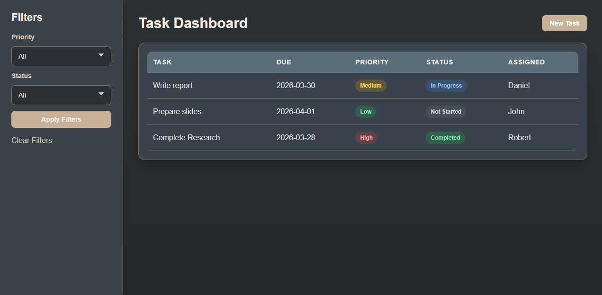

# Task Monitoring System

A web-based task management system built with Flask and MySQL that allows users and teams to organize, track, and monitor tasks efficiently.

## Dashboard Preview


---

## Features

- Task dashboard with filtering by priority and status
- Role-based task visibility  
  - Regular users see only their assigned tasks  
  - Team leaders can view all team tasks  
- Create, edit, and delete tasks
- Assign tasks using a dropdown of existing users
- Persistent data storage using MySQL
- Automatic overdue task detection  
  - Highlights overdue tasks on the dashboard  
  - Displays alert banners for overdue tasks  
- Detailed task view with edit and delete options

---

## Tech Stack

- Frontend: HTML, CSS, JavaScript  
- Backend: Python (Flask)  
- Database: MySQL (XAMPP / phpMyAdmin recommended)

---

## Requirements

- Python 3  
- MySQL (XAMPP recommended)  
- Modern web browser  

---

## Setup Instructions

### 1. Install dependencies

```bash
pip install -r requirements.txt
```

### 2. Start MySQL (XAMPP)

1. Open XAMPP Control Panel  
2. Start:
   - Apache
   - MySQL  
3. Open phpMyAdmin in your browser:
   http://localhost/phpmyadmin

### 3. Create the Database

Create a new database named:

task_monitoring_system

Then run the following SQL:

```sql
USE task_monitoring_system;

CREATE TABLE users (
    id INT AUTO_INCREMENT PRIMARY KEY,
    name VARCHAR(100) NOT NULL,
    role ENUM('regular', 'team_leader') NOT NULL DEFAULT 'regular'
);

CREATE TABLE tasks (
    id INT AUTO_INCREMENT PRIMARY KEY,
    title VARCHAR(150) NOT NULL,
    description TEXT,
    due DATE NOT NULL,
    priority ENUM('Low', 'Medium', 'High') NOT NULL,
    status ENUM('Not Started', 'In Progress', 'Completed') NOT NULL,
    assigned_user_id INT NOT NULL,
    FOREIGN KEY (assigned_user_id) REFERENCES users(id)
);
```

(Optional sample data)

```sql
INSERT INTO users (name, role) VALUES
('Daniel', 'regular'),
('Alex', 'regular'),
('Chris', 'regular'),
('Team Leader', 'team_leader');

INSERT INTO tasks (title, description, due, priority, status, assigned_user_id) VALUES
('Write report', 'Finish the draft for the project report.', '2026-05-30', 'High', 'In Progress', 1),
('Prepare slides', 'Create slides for the final presentation.', '2026-04-21', 'Medium', 'Not Started', 2),
('Code backend', 'Connect Flask routes to MySQL database.', '2026-05-13', 'High', 'Completed', 3);
```

### 4. Run the Application

```bash
python app.py
```

Then open your browser and go to:

http://127.0.0.1:5050


